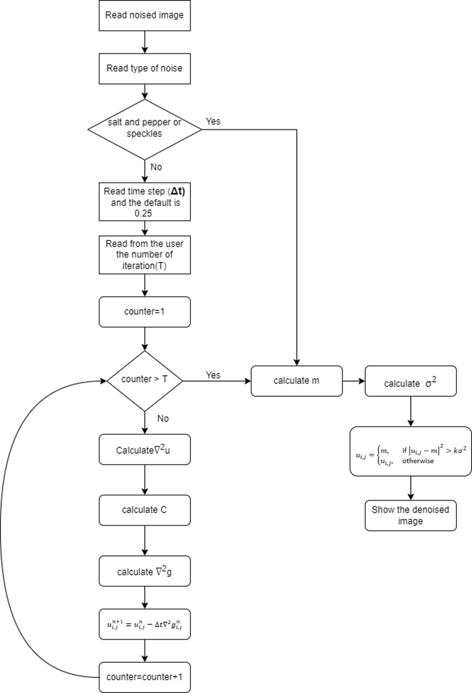
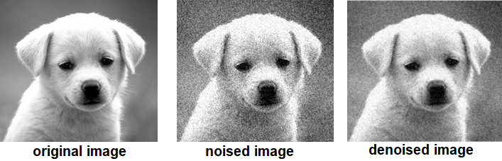
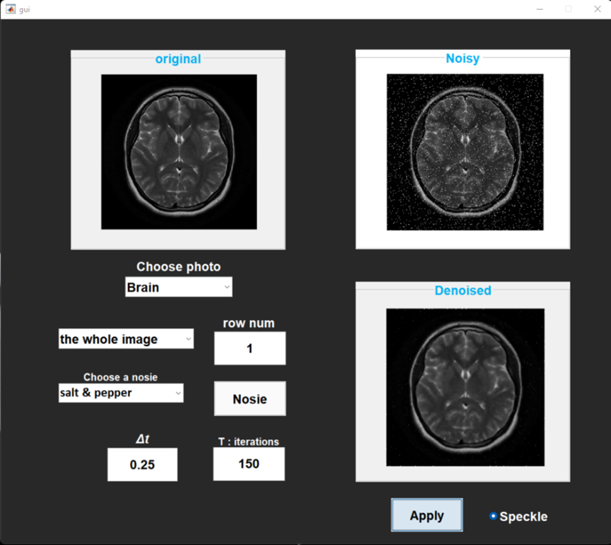

# Image De-noising Application
<i><h5>A GUI application using MATLAB that enhances images quality.</h5></i>

>### Application Description:

* Based on 4^th^ order partial differential equations, it can reduce Gaussian, Poisson, and Speckle noises.
* The algorithm aims to preserve the edges as much as possible so that ML algorithms are able to recognize the output image.
* Running the algorithm for a long period of time (or large iterations) might cause a loss in high frequency details and the image becomes blocky.
* Choosing the proper time size (Δt) and number of iterations (T) is image dependent. Tinker with these two values till you find the sweet spot that spares your image from either being too noisy or too blocky.

>### Flowchart:

>### Gaussian Noise:

>### GUI:

>### Team Members:
* **[Omar Amr Mahmoud Hafz](https://www.linkedin.com/in/omar-hafz-87625123b/)**
* **[Omar Mohamed Tolba](https://www.linkedin.com/in/omar-tolba-057a391b7/)**
* **[Omar Muhammedd Mustafa](https://www.linkedin.com/in/omar-muhammad-3566131b6/)**
* **[Hatem Essam Eldein](https://www.linkedin.com/in/hatem-essam-2000/)**
* **[Ahmed Mohamed Ibrahim](https://www.linkedin.com/in/ahmed-mohamed-33336a219/)**
* **[Saif El-Din Ayman ](https://www.linkedin.com/in/omar-hafz-87625123b/)**
* **[Ramy Atef Mohamed](https://www.linkedin.com/in/omar-hafz-87625123b/)**
* **[Zeyad Ahmed Fawzy](https://www.linkedin.com/in/omar-hafz-87625123b/)**
  